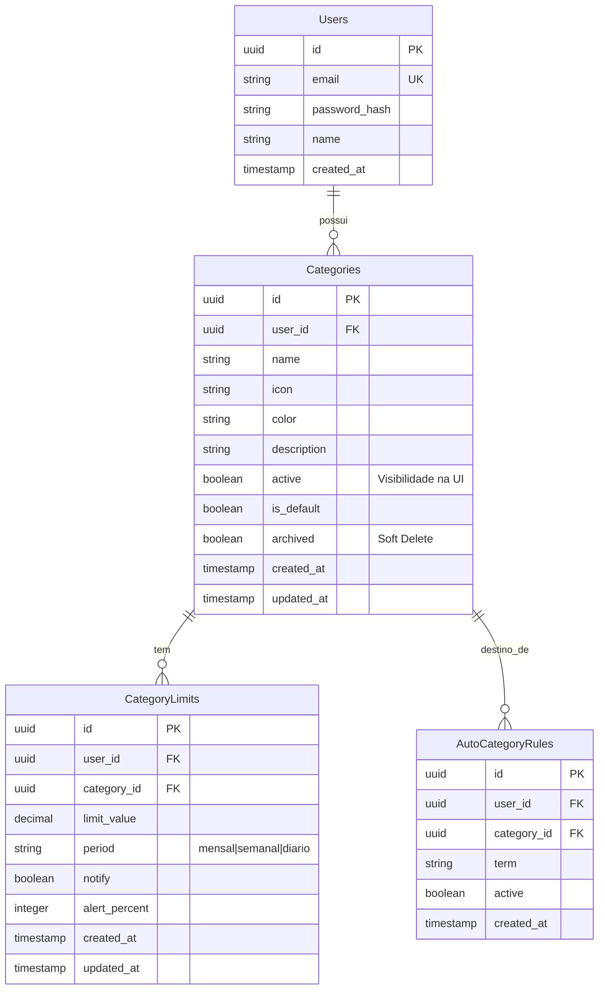

# Modelo de Banco de Dados (Neon / PostgreSQL) - Configurações Apenas

Este modelo foca exclusivamente na persistência das **configurações do usuário** (Categorias, Regras e Limites).
**Transações e Históricos NÃO são salvos no banco**, mantendo o princípio de privacidade ou processamento local ("Local First") para os dados financeiros sensíveis.

## Conceito de Arquivamento (Soft Delete)
As categorias **nunca são deletadas fisicamente** do banco de dados para manter integridade referencial com o histórico local do usuário, caso ele decida restaurar. Em vez disso, usamos a coluna `archived`.
- `archived = FALSE` (Padrão): Categoria visível e ativa.
- `archived = TRUE`: Categoria "excluída" pelo usuário, mas mantida no banco.

## Diagrama Entidade-Relacionamento



## Schema SQL (PostgreSQL)

```sql
-- Habilita extensão para UUIDs
CREATE EXTENSION IF NOT EXISTS "uuid-ossp";

-- 1. Tabela de Usuários
CREATE TABLE users (
    id UUID PRIMARY KEY DEFAULT uuid_generate_v4(),
    email VARCHAR(255) UNIQUE NOT NULL,
    password_hash VARCHAR(255) NOT NULL,
    name VARCHAR(100),
    created_at TIMESTAMP WITH TIME ZONE DEFAULT CURRENT_TIMESTAMP
);

-- 2. Tabela de Categorias (Com suporte a Arquivamento/Soft Delete)
CREATE TABLE categories (
    id UUID PRIMARY KEY DEFAULT uuid_generate_v4(),
    user_id UUID NOT NULL REFERENCES users(id) ON DELETE CASCADE,
    
    name VARCHAR(100) NOT NULL,
    icon VARCHAR(10) NOT NULL, -- Emoji
    color VARCHAR(20) NOT NULL, -- Hex code
    description TEXT,
    
    -- active: Controla se aparece nos filtros/listas (User Toggle)
    active BOOLEAN DEFAULT TRUE, 
    
    -- is_default: Categorias do sistema que não podem ser alteradas/apagadas
    is_default BOOLEAN DEFAULT FALSE,
    
    -- archived: Se TRUE, foi "deletada" pelo usuário, mas existe no banco
    archived BOOLEAN DEFAULT FALSE,
    
    created_at TIMESTAMP WITH TIME ZONE DEFAULT CURRENT_TIMESTAMP,
    updated_at TIMESTAMP WITH TIME ZONE DEFAULT CURRENT_TIMESTAMP,
    
    -- Garante unicidade do nome apenas entre as NÃO arquivadas
    -- Isso permite que o usuário crie uma nova categoria "Uber" mesmo 
    -- se já tiver arquivado uma antiga "Uber".
    UNIQUE(user_id, name) WHERE (archived = FALSE)
);

-- 3. Regras Automáticas
-- Regras dependem de categorias. Se a categoria for arquivada, 
-- a regra pode ser mantida mas ficará inativa ou invisível na aplicação.
CREATE TABLE auto_category_rules (
    id UUID PRIMARY KEY DEFAULT uuid_generate_v4(),
    user_id UUID NOT NULL REFERENCES users(id) ON DELETE CASCADE,
    category_id UUID NOT NULL REFERENCES categories(id), -- Sem DELETE CASCADE para proteger integridade
    
    term VARCHAR(255) NOT NULL,
    active BOOLEAN DEFAULT TRUE,
    
    created_at TIMESTAMP WITH TIME ZONE DEFAULT CURRENT_TIMESTAMP
);

-- 4. Limites de Categoria
-- Se a categoria for arquivada, o limite perde o sentido,
-- mas mantemos o registro histórico.
CREATE TABLE category_limits (
    id UUID PRIMARY KEY DEFAULT uuid_generate_v4(),
    user_id UUID NOT NULL REFERENCES users(id) ON DELETE CASCADE,
    category_id UUID NOT NULL REFERENCES categories(id),
    
    limit_value DECIMAL(12, 2) NOT NULL,
    period VARCHAR(20) DEFAULT 'mensal' CHECK (period IN ('mensal', 'semanal', 'diario')),
    notify BOOLEAN DEFAULT TRUE,
    alert_percent INTEGER DEFAULT 80,
    
    created_at TIMESTAMP WITH TIME ZONE DEFAULT CURRENT_TIMESTAMP,
    updated_at TIMESTAMP WITH TIME ZONE DEFAULT CURRENT_TIMESTAMP,

    -- Um limite por categoria por usuário
    UNIQUE(user_id, category_id)
);

-- Trigger para atualizar updated_at automaticamente
CREATE OR REPLACE FUNCTION update_updated_at_column()
RETURNS TRIGGER AS $$
BEGIN
    NEW.updated_at = NOW();
    RETURN NEW;
END;
$$ language 'plpgsql';

CREATE TRIGGER update_categories_modtime BEFORE UPDATE ON categories FOR EACH ROW EXECUTE PROCEDURE update_updated_at_column();
CREATE TRIGGER update_limits_modtime BEFORE UPDATE ON category_limits FOR EACH ROW EXECUTE PROCEDURE update_updated_at_column();
```

## Fluxo de Uso com Arquivamento

1.  **Usuário "exclui" Categoria**:
    *   Aplicação envia `UPDATE categories SET archived = TRUE, active = FALSE WHERE id = ?`.
    *   No Banco: Registro permanece.
    *   Na UI: Categoria some das listas de seleção, mas transações antigas ainda podem referenciar esse ID se necessário (embora transações não estejam no banco, o ID local pode bater).

2.  **Usuário cria nova Categoria com mesmo nome**:
    *   Como o índice `UNIQUE` tem a cláusula `WHERE (archived = FALSE)`, o banco permite criar "Mercado" novo mesmo existindo um "Mercado" arquivado.

3.  **Sincronização**:
    *   Ao fazer login, o sistema deve baixar `SELECT * FROM categories WHERE user_id = ? AND archived = FALSE`.
